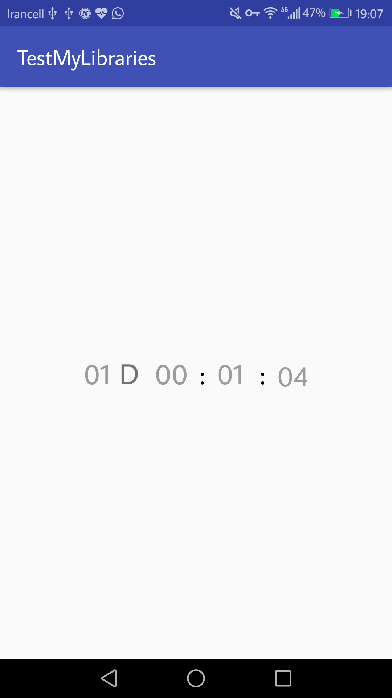

# easyCountDownTimer
A simple android library to countdown timer textview for api 14+

## Screan shot




## Setup

The simplest way to use easyCountDownTimer is to add the library as aar dependency to your build.

#### Maven

```
<dependency>
  <groupId>ir.samanjafari.easycountdowntimer</groupId>
  <artifactId>easycountdowntimer</artifactId>
  <version>2.2.1</version>
  <type>pom</type>
</dependency>
```

#### Gradle

```
repositories {
    maven {
             url 'https://dl.bintray.com/samanjafaridotir/easyCountDownTimerTextview'
          }
}

dependencies {
    compile 'ir.samanjafari.easycountdowntimer:easycountdowntimer:2.3.1'
}
```

#### Usage

Add the following code to your view

```xml
<ir.samanjafari.easycountdowntimer.EasyCountDownTextview
        android:id="@+id/easyCountDownTextview"
        android:layout_width="wrap_content"
        android:layout_height="wrap_content"
        android:layout_centerInParent="true"
        app:hours="0"
        app:minute="1"
        app:second="10"
        app:showHours="true"
        app:textSize="12sp"
        app:digitBackground="@android:color/transparent"
        app:textColor="#9c9c9c"
        app:setAnimation="true"
        app:colonColor="#000"
        app:showDays="true"
        app:daysLabel="D"
        app:days="1"
        app:start_automatically="false"
        />
```

whit the following code you can listen to onFinish or onTick timer

```java
EasyCountDownTextview countDownTextview = (EasyCountDownTextview) findViewById(R.id.easyCountDownTextview);
easyCountDownTextview.setTime(1, 1, 1, 1);
        easyCountDownTextview.setOnTick(new CountDownInterface() {
            @Override
            public void onTick(long time) {
                
            }

            @Override
            public void onFinish() {

            }
        });
```
how to set time programmatically ?

```java
EasyCountDownTextview easyCountDownTextview = (EasyCountDownTextview) findViewById(R.id.easyCountDownTextview);
easyCountDownTextview.setTime(1,1, 30, 15);// setTime(days, hours, minute, second)
```

## Licence

Copyright 2017 Saman Jafari

Licensed under the Apache License, Version 2.0 (the "License"); you may not use this file except in compliance with the License. You may obtain a copy of the License at

http://www.apache.org/licenses/LICENSE-2.0

Unless required by applicable law or agreed to in writing, software distributed under the License is distributed on an "AS IS" BASIS, WITHOUT WARRANTIES OR CONDITIONS OF ANY KIND, either express or implied. See the License for the specific language governing permissions and limitations under the License.

## Author

Saman Jafari

email: saman.jafari69@gmail.com

github: https://github.com/jsaman19

site : http://samanjafari.ir


